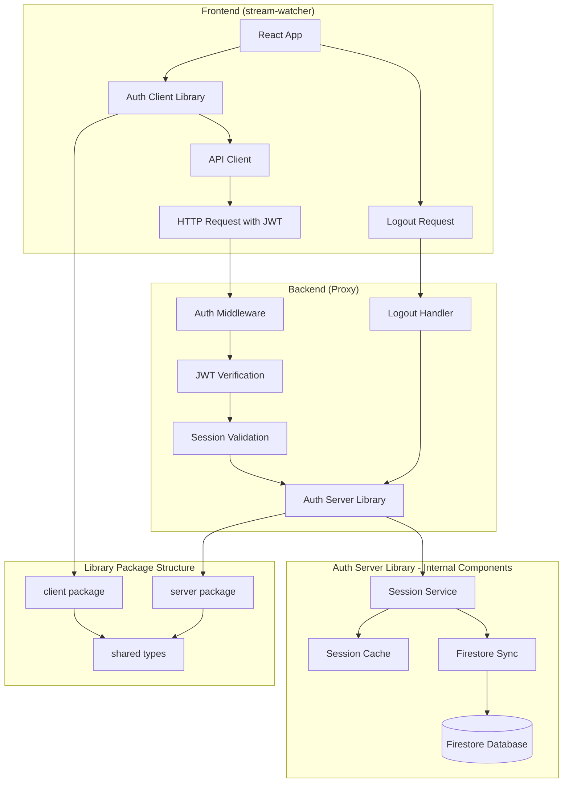
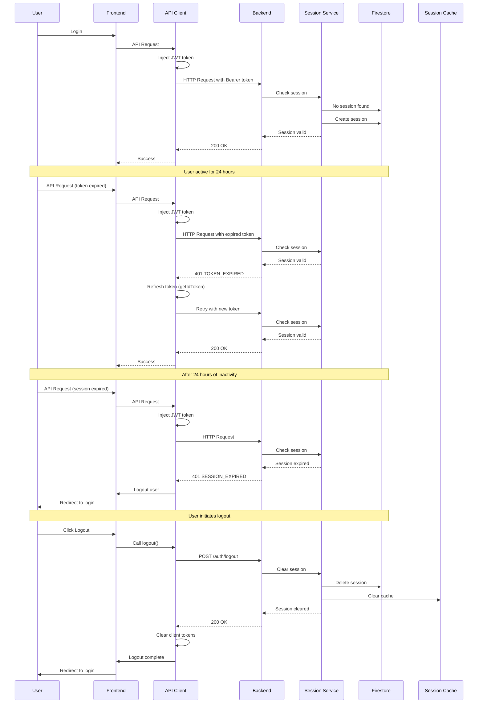
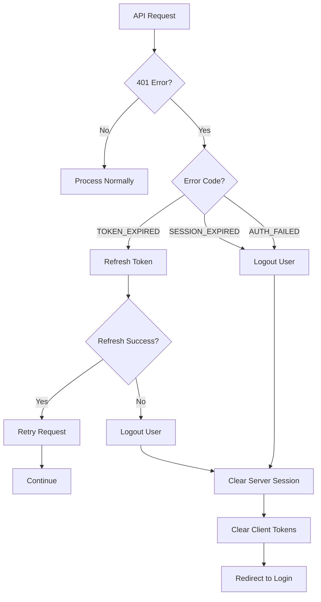
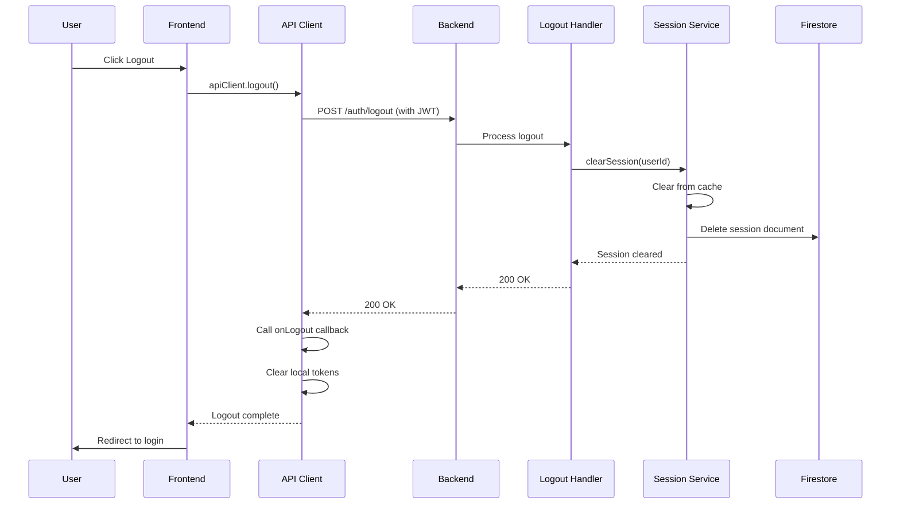

**Version History:**
- **v1.1**: Added complete logout flow (server-side and client-side session clearing)
- **v1.0**: Initial design for session management and token expiration

# Solution Design: Session Management and Token Expiration Fix

## Executive Summary

This document outlines a solution to implement proper session management with inactivity timeout and fix 401 error handling in the stream-watcher application. The solution introduces a unified authentication library (`@rapidraptor/auth`) that provides both client-side and server-side components for managing user sessions, handling token expiration, and providing a seamless user experience.

**Key Benefits:**
- Automatic session expiration after 24 hours of inactivity
- Proper distinction between session expiration and token expiration
- Improved user experience with automatic token refresh
- Reduced security risk from long-lived sessions
- Complete session lifecycle management (create, validate, clear)
- Reusable authentication library for future projects

## Problem Statement

### Current Issues

1. **No Session Management**: The application currently relies solely on Firebase JWT tokens for authentication. There is no server-side session tracking, meaning:
   - Users can remain authenticated indefinitely as long as their JWT token is valid
   - No way to enforce inactivity timeouts
   - No ability to revoke sessions server-side

2. **Poor 401 Error Handling**: When a 401 error occurs, the system cannot distinguish between:
   - **Token Expiration**: The JWT token has expired but the user's session may still be valid (should refresh token)
   - **Session Expiration**: The user's session has expired due to inactivity (should logout)

3. **User Experience Issues**:
   - Users are logged out even when their session is still valid but token expired
   - No warning before session expiration
   - Polling continues even after authentication errors occur

4. **Code Duplication**: Authentication logic is scattered across frontend and backend codebases, making it difficult to maintain consistency.

### Impact

- **Security Risk**: Long-lived sessions increase the risk of unauthorized access if a device is compromised
- **Poor User Experience**: Users are unexpectedly logged out even when they could continue working
- **Maintenance Burden**: Duplicated authentication logic across projects increases maintenance costs

## Solution Overview

### High-Level Approach

We will create a unified `@rapidraptor/auth` library that provides:

1. **Server-Side Session Management**: Track user sessions in Firestore with inactivity timeout
2. **Client-Side Token Management**: Automatically handle token refresh and session expiration
3. **Unified Error Handling**: Distinguish between token expiration and session expiration
4. **Complete Logout Flow**: Server-side session invalidation on logout
5. **Reusable Components**: Single source of truth for authentication across all projects

### Core Concepts

**Session vs Token:**
- **Session**: Server-side record of user activity, expires after 24 hours of inactivity
- **Token**: Short-lived JWT from Firebase (typically 1 hour), can be refreshed if session is valid

**Two-Layer Authentication:**
1. JWT verification (existing) - validates the token is valid and not expired
2. Session validation (new) - validates the user's session is still active

### Solution Architecture

The solution consists of three main components:

1. **@rapidraptor/auth Library**: A monorepo containing:
   - `/client` - Frontend library for React applications
   - `/server` - Backend library for Node.js/Express applications
   - `/shared` - Shared types and constants

2. **Backend Integration**: Proxy service uses `/server` to validate sessions
3. **Frontend Integration**: stream-watcher app uses `/client` for API calls and error handling

## Similar Solutions in the Wild

### 1. AWS Cognito Session Management

**How it works:**
- AWS Cognito maintains server-side sessions with configurable expiration
- Access tokens (short-lived) and refresh tokens (long-lived) are managed separately
- Session state is stored in a database and checked on each request

**Relevance:**
- Similar two-layer approach (token + session)
- Session expiration based on inactivity
- Automatic token refresh when session is valid

### 2. OAuth 2.0 with Refresh Tokens

**How it works:**
- Access tokens are short-lived (minutes to hours)
- Refresh tokens are long-lived but can be revoked server-side
- Server maintains session state to validate refresh token usage

**Relevance:**
- Distinguishes between token expiration and session expiration
- Server-side session tracking enables revocation
- Standard pattern used by Google, GitHub, Microsoft

### 3. Firebase Admin Session Management

**How it works:**
- Many applications using Firebase Auth implement custom session management
- Store session metadata in Firestore
- Use in-memory cache for performance
- Batch writes to reduce Firestore costs

**Relevance:**
- Directly applicable to our Firebase-based architecture
- Firestore as session store is a common pattern
- Cache-first approach for performance

### 4. Express-Session with Redis

**How it works:**
- Server stores session data in Redis
- In-memory cache for frequently accessed sessions
- Session expiration handled by Redis TTL

**Relevance:**
- Similar architecture (cache + persistent store)
- Inactivity timeout pattern
- Performance optimization through caching

## Solution Components

### Component 1: @rapidraptor/auth Library

**Purpose:** Unified authentication library for client and server

**Sub-components:**

#### 1.1 Client Package (`/client`)
- **API Client**: Axios-based HTTP client with automatic token injection
- **Error Handler**: Detects SESSION_EXPIRED vs TOKEN_EXPIRED and handles appropriately
- **Token Manager**: Handles token refresh with request queuing
- **Logout Method**: Unified logout that clears both server-side session and client-side tokens
- **React Hooks**: `useApiClient`, `useSessionMonitor` for React applications

#### 1.2 Server Package (`/server`)
- **Session Service**: Manages user sessions with cache-first lookup
- **Session Cache**: In-memory cache for fast session validation
- **Firestore Sync**: Batched writes to Firestore for persistence
- **Auth Middleware**: Express middleware for session validation
- **Logout Handler**: Express middleware/handler for clearing sessions on logout

**Server Package Functionality:**
- Session creation on first authenticated request
- Activity tracking on each request
- Session expiration after 24 hours of inactivity
- Session clearing on logout (cache + Firestore)
- Cache-first lookup (90%+ cache hit rate expected)
- Firestore persistence for multi-instance deployments

**Storage:**
- **In-Memory Cache**: Fast lookup for active sessions (internal to Session Cache component)
- **Firestore**: Persistent storage for session data (accessed via Firestore Sync component)
- **Collection**: `user_sessions/{userId}`

#### 1.3 Shared Package (`/shared`)
- **Types**: Common TypeScript interfaces (SessionInfo, ErrorResponse, etc.)
- **Constants**: Error codes, default timeouts, configuration defaults

### Component 2: Backend Integration

**Purpose:** Integrate the Auth Server Library into the proxy service

**Integration Points:**
- Import and initialize SessionService from `@rapidraptor/auth/server`
- Use Auth Middleware from the library in Express routes
- Use Logout Handler from the library for logout endpoint
- Configure Firebase Admin SDK for Firestore access
- Expose logout endpoint (e.g., `POST /auth/logout`) using the logout handler

### Component 3: Frontend Token Management

**Purpose:** Handle token refresh and session expiration gracefully

**Key Features:**
- Automatic token injection in API requests
- Token refresh on TOKEN_EXPIRED errors
- Automatic logout on SESSION_EXPIRED errors
- Unified logout method that clears server-side session and client-side tokens
- Request queuing during token refresh
- Stop polling on authentication errors

## System Architecture

### Overall System Flow

### User Session Lifecycle

### Error Handling Flow

### Logout Flow

### Logout Implementation Details

**Client-Side Logout:**
- The API client provides a `logout()` method that:
  1. Calls the server logout endpoint (`POST /auth/logout`) with the current JWT token
  2. On success, calls the `onLogout` callback (provided by the application)
  3. The `onLogout` callback typically:
     - Calls Firebase `signOut()` to clear client-side tokens
     - Redirects to the login page
  4. If the server logout fails, client-side logout still proceeds (graceful degradation)

**Server-Side Logout:**
- The logout handler:
  1. Requires authentication (uses the same auth middleware)
  2. Extracts `userId` from the authenticated request (`req.user.sub`)
  3. Calls `sessionService.clearSession(userId)` which:
     - Immediately clears the session from the in-memory cache
     - Deletes the session document from Firestore
  4. Returns 200 OK on success

**Key Design Decisions:**
- **Idempotent**: Logout can be called multiple times safely (no error if session already cleared)
- **Graceful Degradation**: Client-side logout proceeds even if server logout fails
- **Security**: Logout endpoint requires authentication to prevent unauthorized session clearing
- **Performance**: Cache clearing is immediate; Firestore deletion is synchronous for security

**Integration Requirements:**
- Applications must expose a logout endpoint (e.g., `POST /auth/logout`) using the provided logout handler
- Applications must provide an `onLogout` callback when creating the API client
- The logout endpoint should be protected by the auth middleware to ensure only authenticated users can clear their own sessions

## Cost Estimate

### Infrastructure Costs

#### Firestore Operations

**Assumptions:**
- 1,000 active users
- Average 10 API requests per user per hour
- 90% cache hit rate (only 10% of requests hit Firestore)
- 5-minute write throttle per user

**Read Operations:**
- Requests per hour: 1,000 users × 10 requests = 10,000 requests
- Firestore reads (10% miss rate): 10,000 × 10% = 1,000 reads/hour
- Reads per day: 1,000 × 24 = 24,000 reads/day
- **Cost**: 24,000 reads × $0.06 per 100,000 = **$0.014/day** (~$0.42/month)

**Write Operations:**
- Writes per user: 1 write per 5 minutes = 12 writes/hour
- Total writes: 1,000 users × 12 = 12,000 writes/hour
- Writes per day: 12,000 × 24 = 288,000 writes/day
- **Cost**: 288,000 writes × $0.18 per 100,000 = **$0.52/day** (~$15.60/month)

**Storage:**
- Document size: ~200 bytes per session
- Total storage: 1,000 sessions × 200 bytes = 200 KB
- **Cost**: Negligible (< $0.01/month)

**Total Firestore Cost: ~$16/month** for 1,000 active users

#### Scaling Estimates

| Users | Reads/Day | Writes/Day | Monthly Cost |
|-------|-----------|------------|--------------|
| 100   | 2,400     | 28,800     | ~$1.60       |
| 1,000 | 24,000    | 288,000    | ~$16.00      |
| 10,000| 240,000   | 2,880,000  | ~$160.00     |

**Note:** Costs scale linearly with user count. Cache hit rate may improve with more users (more sessions in cache).

### Development Costs

**Estimated Effort:**
- Library development: 3-4 weeks
- Backend integration: 1 week
- Frontend integration: 1 week
- Testing and QA: 1-2 weeks
- **Total: 6-8 weeks**

**Team Requirements:**
- 1-2 Full-stack developers
- 1 QA engineer (part-time)

### Maintenance Costs

**Ongoing Maintenance:**
- Library updates and bug fixes: ~4 hours/month
- Monitoring and alerting: Included in existing infrastructure
- Documentation updates: ~2 hours/month

## Success Criteria

### Functional Requirements

1. ✅ Sessions expire after 24 hours of inactivity
2. ✅ Token expiration triggers automatic refresh (if session valid)
3. ✅ Session expiration triggers automatic logout
4. ✅ User-initiated logout clears both server-side session and client-side tokens
5. ✅ Polling stops on authentication errors
6. ✅ Session data persists across server restarts

### Performance Requirements

1. ✅ Session validation < 10ms (cache hit)
2. ✅ Session validation < 100ms (cache miss, Firestore read)
3. ✅ 90%+ cache hit rate in production
4. ✅ Firestore write operations throttled to max 1 per 5 minutes per user

### User Experience Requirements

1. ✅ No unexpected logouts when token expires but session is valid
2. ✅ Clear error messages for session expiration
3. ✅ Automatic token refresh is transparent to user
4. ✅ Polling gracefully handles authentication errors
5. ✅ Logout immediately invalidates session on server (security)
6. ✅ Logout works consistently across all applications using the library

## Risks and Mitigations

### Risk 1: Firestore Unavailability

**Risk:** If Firestore is unavailable, session validation fails

**Mitigation:**
- Return 503 Service Unavailable (do not allow requests to proceed)
- Log errors for monitoring
- Firestore has 99.95% uptime SLA

### Risk 2: Cache Inconsistency

**Risk:** Cache and Firestore may become out of sync

**Mitigation:**
- Cache-first with Firestore fallback
- Cache cleared on session expiration
- Periodic cache warmup on server restart

### Risk 3: High Firestore Costs

**Risk:** Write operations could become expensive at scale

**Mitigation:**
- 5-minute throttle per user (max 12 writes/hour)
- Batch writes to reduce operation count
- Monitor costs and adjust throttle if needed

### Risk 4: User Experience During Migration

**Risk:** Users may be logged out during deployment

**Mitigation:**
- Deploy backend first (sessions created automatically)
- Deploy frontend second (handles new error codes)
- Communicate deployment window to users

### Risk 5: Logout Endpoint Not Implemented

**Risk:** Applications may forget to implement the logout endpoint, leaving sessions active after logout

**Mitigation:**
- Provide clear documentation and examples
- Include logout handler in library exports
- Make logout endpoint integration part of integration checklist
- Add validation/warnings in development mode if logout endpoint is missing

## Deployment Strategy

### Phased Rollout

1. **Phase 1**: Deploy `@rapidraptor/auth` library (no impact)
2. **Phase 2**: Deploy backend with session management (sessions created automatically)
3. **Phase 3**: Deploy frontend with new error handling (users may need to re-login)

### Rollback Plan

- Backend rollback: Revert to previous version (sessions ignored)
- Frontend rollback: Revert to previous version
- No data cleanup required

### Post-Deployment Verification

- Monitor session creation in Firestore
- Verify error rates remain low
- Check Firestore operation counts
- Validate user experience (no unexpected logouts)

## Next Steps

1. **Review and Approve**: Stakeholder review of this solution design
2. **Technical Design**: Create detailed technical design document (after approval)
3. **Implementation**: Begin development following technical design
4. **Testing**: Comprehensive testing in staging environment
5. **Deployment**: Phased rollout to production

## Appendix

### Glossary

- **Session**: Server-side record of user activity with expiration timestamp
- **Token**: Short-lived JWT from Firebase used for authentication
- **Inactivity Timeout**: Period of time (24 hours) after which session expires
- **Cache Hit**: Session found in in-memory cache (fast path)
- **Cache Miss**: Session not in cache, requires Firestore lookup (slow path)
- **Logout**: Process of clearing both server-side session (Firestore + cache) and client-side tokens
- **Logout Handler**: Server-side middleware that clears sessions when logout endpoint is called

### References

- Firebase Authentication: https://firebase.google.com/docs/auth
- Firestore Documentation: https://firebase.google.com/docs/firestore
- OAuth 2.0 Best Practices: https://oauth.net/2/
- AWS Cognito Session Management: https://docs.aws.amazon.com/cognito/

---

**Document Status:** Draft - Awaiting Approval

**Next Review Date:** TBD

**Approvers:** [To be determined]

